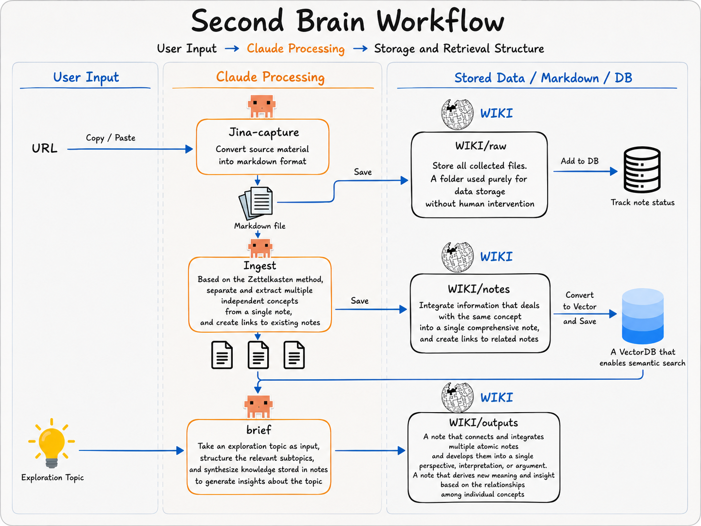

# 🧠 Second Brain

<p align="center">
  
</p>

<p align="center">
  <a href="LICENSE"></a>
  
  <a href="https://claude.com/claude-code"></a>
  <a href="https://obsidian.md"></a>
</p>

> 흩어진 메모·기사·생각을 한곳에 모으면, [Claude Code](https://claude.com/claude-code)가 정리·연결·검색·요약까지 도와주는 개인 위키입니다.
>
> A personal wiki: dump your raw notes, articles, and thoughts in one place, and [Claude Code](https://claude.com/claude-code) distills, links, searches, and summarizes them for you.

**언어 / Language:** [🇰🇷 한국어](#-한국어) · [🇺🇸 English](#-english)

---

## 🇰🇷 한국어

> 📖 **[Second Brain 작동 원리 튜토리얼 →](docs/tutorial-how%20it%20works%20under%20the%20hood.html)** — 시스템이 내부에서 어떻게 동작하는지 차근차근 설명하는 가이드입니다.

### 이게 뭔가요?

**Second Brain(제2의 뇌)** 은 내가 모은 자료를 차곡차곡 쌓아두는 개인 지식 창고입니다. 핵심 아이디어는 간단합니다.

1. **모으기** — 기사, 회의록, 떠오른 생각 등 무엇이든 일단 `wiki/raw/` 폴더에 던져 넣습니다. 정리는 나중에.
2. **정리하기** — Claude Code에게 `/ingest`라고 시키면, 날것의 메모를 읽고 **깔끔하게 정리된 노트**로 바꿔 서로 연결해 줍니다.
3. **꺼내쓰기** — `/ask`로 질문하면 내 노트를 근거로 답해 주고, `/brief`로 특정 주제에 대한 **문서**를 만들어 줍니다.

> 💡 **코딩을 몰라도 괜찮습니다.** 어려운 작업(정리·연결·검색·요약)은 전부 Claude Code가 합니다. 여러분은 자료를 모으고, 채팅창에 `/명령어`를 입력하기만 하면 됩니다.

### 3가지 폴더만 기억하세요

| 폴더 | 용도 | 직접 손대도 되나요? |
|---|---|---|
| `wiki/raw/` | **모으는 곳.** 기사, 메모, 생각을 그대로 던져 넣습니다. | 추가만 하세요. 기존 파일은 **수정·삭제 금지** (원본 보존) |
| `wiki/notes/` | **정리된 위키.** Claude가 raw를 다듬어 만든, 서로 연결된 노트들. | 마음껏 고쳐도 됩니다 |
| `wiki/outputs/` | **결과물.** Claude가 만든 브리핑·메모·문서. | 언제든 지워도 됩니다 |

> 🌱 이 템플릿에는 **예시 노트 몇 개**가 들어 있습니다 (`example` 태그가 붙은 [[second-brain]] · [[zettelkasten]] · [[atomic-notes]] · [[evergreen-notes]]). `/ask`·그래프 뷰·검색이 처음부터 동작하도록 미리 채워둔 것이니, 빈 상태로 시작하고 싶으면 지워도 됩니다.

### 시작하기 (단계별)

#### 0. 미리 준비할 것

- **[Claude Code](https://claude.com/claude-code)** 설치 (이 모든 명령어를 실행하는 도구입니다)
- **Python 3.13** (검색·색인용 스크립트를 돌립니다)
- **Gemini API 키** — [Google AI Studio](https://aistudio.google.com/apikey)에서 무료로 발급받을 수 있습니다 (의미 기반 검색에 사용)

#### 1. 프로젝트 환경 만들기

터미널을 열고, 이 폴더 안에서 아래를 차례대로 입력하세요. (한 줄씩 복사해서 붙여넣으면 됩니다.)

```bash
# 격리된 파이썬 환경(.venv)을 만들고 켭니다
python3.13 -m venv .venv
source .venv/bin/activate

# 필요한 라이브러리를 설치합니다
pip install -r requirements.txt
```

> ⚠️ 반드시 `python3.13`을 쓰세요. 더 낮은 버전에서는 일부 라이브러리 설치가 실패할 수 있습니다.

#### 2. Gemini API 키 등록하기

발급받은 키를 `.env` 파일에 저장합니다. (`.env`는 비밀 파일이라 GitHub에 올라가지 않습니다.)

```bash
echo "GEMINI_API_KEY=여기에-발급받은-키-붙여넣기" > .env
```

#### 3. 첫 자료 넣어보기

직접 메모를 하나 만들어 보거나, 웹 기사를 통째로 가져올 수 있습니다.

```bash
# 방법 A — 직접 메모 작성
echo "# 오늘 떠오른 생각" > wiki/raw/2026-06-13-first-note.md
```

방법 B — **웹 기사 가져오기**: Claude Code 채팅창에 URL과 함께 명령어를 입력하세요.

```
/jina-capture https://example.com/읽고-싶은-기사
```

→ 해당 페이지를 깔끔한 마크다운으로 변환해 `wiki/raw/`에 저장해 줍니다.

#### 4. Claude Code에게 정리시키기

이제 Claude Code 채팅창에서 명령어를 입력하면 됩니다.

```
/ingest              # raw의 새 파일들을 읽어 notes로 정리·연결
/ask 내가 모은 X에 대해 알려줘   # 내 노트를 근거로 답변
/brief X 주제로 정리해줘          # X에 대한 문서를 outputs에 생성
/garden              # 주간 청소 (중복·끊긴 링크·미아 노트 정리)
```

### 슬래시 명령어 모음

채팅창에 `/`로 시작하는 명령어를 입력하면 Claude가 그에 맞는 작업을 합니다.

| 명령어 | 하는 일 |
|---|---|
| `/jina-capture <url>` | 웹페이지를 깔끔한 마크다운으로 변환해 `wiki/raw/`에 저장합니다. |
| `/ingest` | `wiki/raw/`의 새 파일을 정리된 노트로 만들고, 서로 연결한 뒤 검색 색인을 갱신합니다. |
| `/ask <질문>` | 노트를 의미 기반으로 검색해 채팅으로 답합니다. 근거 노트를 `[[링크]]`로 인용합니다. (파일 생성 안 함) |
| `/brief <주제>` | 관련 노트를 모아 `wiki/outputs/`에 브리핑 문서를 작성합니다. (마크다운 기본, HTML·docx·pdf도 가능) |
| `/garden` | 주간 정리 — 미아 노트, 중복, 끊긴 링크, 오래된 초안을 찾아 정리합니다. |
| `/shortwrite` | 긴 글을 특정 관점으로 짧은 SNS용 글로 압축합니다 (`shortwrite.html` 2분할 캔버스 사용). |

### 일상적인 사용 흐름

```
모으기  →  정리  →  꺼내쓰기  →  (주간) 청소
raw에     /ingest    /ask로 질문      /garden
던져넣기            /brief로 문서화
```

1. **모으기** — 자료를 `wiki/raw/`에 자유롭게 넣거나 `/jina-capture`로 웹에서 가져옵니다.
2. **정리** — `/ingest`로 새 자료를 노트로 변환합니다.
3. **꺼내쓰기** — `/ask`로 빠르게 묻거나, `/brief`로 긴 문서를 만듭니다.
4. **청소** — 매주 `/garden`으로 정리합니다.

### 📝 Obsidian과 함께 쓰면 더 편해요 (추천)

이 위키는 전부 일반 마크다운(`.md`) 파일이라, [Obsidian](https://obsidian.md) 같은 마크다운 앱으로 열면 노트를 훨씬 보기 좋게 보고 편집할 수 있습니다. 특히 궁합이 좋습니다:

- **이 폴더 자체가 이미 Obsidian 보관함(vault)** 입니다 (`.obsidian/` 설정 포함). Obsidian에서 "폴더를 보관함으로 열기(Open folder as vault)"로 이 폴더를 그대로 열기만 하면 됩니다.
- 노트끼리 연결한 `[[위키링크]]`를 클릭 한 번으로 따라갈 수 있고, **그래프 뷰**로 노트 사이의 연결 관계를 한눈에 볼 수 있습니다.
- **역링크(backlink)** 패널이 "이 노트를 가리키는 다른 노트들"을 자동으로 보여줍니다.
- 미리보기·실시간 편집·검색이 편해서, Claude가 정리해 준 `wiki/notes/`를 사람이 직접 다듬기에 좋습니다.

> Claude Code는 **정리·연결·검색**을, Obsidian은 **보기·편집·탐색**을 맡는 식으로 함께 쓰면 가장 좋습니다.

### 상태 대시보드 (선택)

아직 정리 안 된 자료가 몇 개인지 한눈에 보고 싶다면:

```bash
python scripts/dashboard.py            # http://localhost:3100 에서 확인
python scripts/dashboard.py --port 8000
```

### 🛠 작동 방식

URL 하나가 노트가 되고, 그 노트들이 모여 한 편의 글이 되기까지 — 전체 흐름은 다음과 같습니다. **수집 → 보관함 → 색인 & 검색**의 3단계로, 벡터는 LanceDB에, 링크·장부는 SQLite에 나눠 저장됩니다.

<p align="center">
  
</p>

### 전체 폴더 구조

```
wiki/
  raw/       # 모으는 곳 (추가만, 수정·삭제 금지)
  notes/     # 정리된 위키 (서로 연결된 노트)
  outputs/   # 결과물 (브리핑·문서)
  lancedb/   # 의미 검색용 벡터 저장소 (자동 생성)
  index.db   # 링크·색인 메타데이터 (자동 생성)
scripts/
  ingest.py    # 정리 보조 + 처리 기록(ledger) 관리
  reindex.py   # notes를 읽어 검색 색인 재생성
  search.py    # 의미 검색·태그 필터·역링크
  dashboard.py # 미처리 자료 현황 페이지 (localhost:3100)
.claude/
  commands/  # /ingest, /ask, /brief, /garden 정의
  skills/    # jina-capture, shortwrite 정의
  settings.json
shortwrite.html # 긴 글 → 짧은 글 변환용 2분할 캔버스
CLAUDE.md    # Claude가 매 세션 따르는 규칙
```

> 더 자세한 규칙과 컨벤션은 `CLAUDE.md`를 참고하세요.

---

## 🇺🇸 English

### What is this?

**Second Brain** is a personal knowledge vault where you stockpile everything you collect. The idea is simple:

1. **Capture** — Toss anything (articles, meeting notes, stray thoughts) into the `wiki/raw/` folder. Organize later.
2. **Distill** — Tell Claude Code `/ingest`, and it reads your raw dumps and turns them into **clean, interlinked notes**.
3. **Retrieve** — Ask questions with `/ask` (answered from your own notes), or generate a **document** on any topic with `/brief`.

> 💡 **No coding required.** Claude Code does the hard parts (distilling, linking, searching, summarizing). You just collect material and type `/commands` into the chat.

### Just remember 3 folders

| Folder | Purpose | Can I edit it? |
|---|---|---|
| `wiki/raw/` | **Where you capture.** Drop articles, notes, and thoughts here as-is. | Add only. **Never edit or delete** existing files (keep originals intact) |
| `wiki/notes/` | **The distilled wiki.** Interlinked notes Claude derives from raw. | Edit freely |
| `wiki/outputs/` | **Deliverables.** Briefs, memos, and docs Claude generates. | Delete anytime |

> 🌱 This template ships with **a few example notes** (tagged `example`: [[second-brain]], [[zettelkasten]], [[atomic-notes]], [[evergreen-notes]]) so `/ask`, the graph view, and search work out of the box. Delete them whenever you want a blank slate.

### Getting started (step by step)

#### 0. Prerequisites

- **[Claude Code](https://claude.com/claude-code)** installed (this is the tool that runs all the commands)
- **Python 3.13** (runs the search & indexing scripts)
- **A Gemini API key** — get one free at [Google AI Studio](https://aistudio.google.com/apikey) (used for semantic search)

#### 1. Set up the project environment

Open a terminal, and inside this folder run the following in order (copy-paste line by line):

```bash
# Create and activate an isolated Python environment (.venv)
python3.13 -m venv .venv
source .venv/bin/activate

# Install the required libraries
pip install -r requirements.txt
```

> ⚠️ Be sure to use `python3.13`. Lower versions may fail to install some libraries.

#### 2. Register your Gemini API key

Save your key in a `.env` file. (`.env` is secret and is never pushed to GitHub.)

```bash
echo "GEMINI_API_KEY=paste-your-key-here" > .env
```

#### 3. Add your first material

Write a note yourself, or pull in a whole web article.

```bash
# Option A — write a note directly
echo "# A thought I had today" > wiki/raw/2026-06-13-first-note.md
```

Option B — **grab a web article**: in the Claude Code chat, type the command with a URL.

```
/jina-capture https://example.com/article-you-want-to-read
```

→ It converts that page into clean markdown and saves it into `wiki/raw/`.

#### 4. Let Claude Code organize it

Now just type commands in the Claude Code chat.

```
/ingest                      # read new raw files → distill & link into notes
/ask Tell me about X I saved  # answer grounded in your notes
/brief Write up topic X       # generate a document on X into outputs
/garden                      # weekly cleanup (dupes, broken links, orphans)
```

### Slash command reference

Type a `/`-prefixed command in the chat and Claude performs the matching task.

| Command | What it does |
|---|---|
| `/jina-capture <url>` | Converts a web page to clean markdown and saves it to `wiki/raw/`. |
| `/ingest` | Distills new files in `wiki/raw/` into linked notes and refreshes the search index. |
| `/ask <question>` | Semantically searches your notes and answers in chat, citing sources with `[[wikilinks]]`. (No file output.) |
| `/brief <topic>` | Gathers relevant notes and writes a brief into `wiki/outputs/`. (Markdown by default; HTML, docx, pdf on request.) |
| `/garden` | Weekly cleanup — finds orphans, duplicates, broken links, and stale drafts. |
| `/shortwrite` | Compresses a long piece into a short, angled SNS post (uses the `shortwrite.html` two-pane canvas). |

### Everyday workflow

```
Capture  →  Distill  →  Retrieve   →  (weekly) Clean
drop into    /ingest     /ask to query    /garden
raw/                     /brief to write
```

1. **Capture** — Drop material into `wiki/raw/` freely, or pull from the web with `/jina-capture`.
2. **Distill** — Run `/ingest` to turn new material into notes.
3. **Retrieve** — Use `/ask` for quick answers or `/brief` for longer documents.
4. **Clean** — Run `/garden` weekly to tidy up.

### 📝 Pairs great with Obsidian (recommended)

The whole wiki is just plain markdown (`.md`) files, so opening it in a markdown app like [Obsidian](https://obsidian.md) makes the notes much nicer to read and edit. It's an especially good fit:

- **This folder is already an Obsidian vault** (it ships with an `.obsidian/` config). Just choose "Open folder as vault" in Obsidian and point it at this folder.
- Follow the `[[wikilinks]]` between notes with a single click, and see how everything connects in the **graph view**.
- The **backlinks** panel automatically shows you "other notes that point to this one."
- Preview, live edit, and search make it easy to hand-polish the `wiki/notes/` that Claude distilled for you.

> Best used together: Claude Code handles **distilling, linking, and search**; Obsidian handles **viewing, editing, and exploring**.

### Status dashboard (optional)

To see at a glance how much material is still unprocessed:

```bash
python scripts/dashboard.py            # view at http://localhost:3100
python scripts/dashboard.py --port 8000
```

### 🛠 How it works

One URL becomes a note, and notes become a finished piece — here's the whole flow at a glance: **you capture → Claude processes (`/jina-capture`, `/ingest`, `/brief`) → everything is stored as searchable markdown**, with vectors in LanceDB and the link graph & ledger in SQLite.

<p align="center">
  
</p>

### Full folder layout

```
wiki/
  raw/       # where you capture (add only; never edit/delete)
  notes/     # distilled wiki (interlinked notes)
  outputs/   # deliverables (briefs/docs)
  lancedb/   # vector store for semantic search (auto-generated)
  index.db   # link & index metadata (auto-generated)
scripts/
  ingest.py    # distillation helpers + processing ledger
  reindex.py   # rebuilds the search index from notes
  search.py    # semantic search, tag filter, backlinks
  dashboard.py # unprocessed-material status page (localhost:3100)
.claude/
  commands/  # /ingest, /ask, /brief, /garden definitions
  skills/    # jina-capture, shortwrite definitions
  settings.json
shortwrite.html # two-pane canvas: long source → short angled draft
CLAUDE.md    # the conventions Claude follows every session
```

> See `CLAUDE.md` for the full set of rules and conventions.

---

<p align="center">
  <sub>Built by <a href="https://github.com/hooman34">Gieun Kwak</a> · Powered by <a href="https://claude.com/claude-code">Claude Code</a> · Licensed under <a href="LICENSE">MIT</a></sub>
</p>
